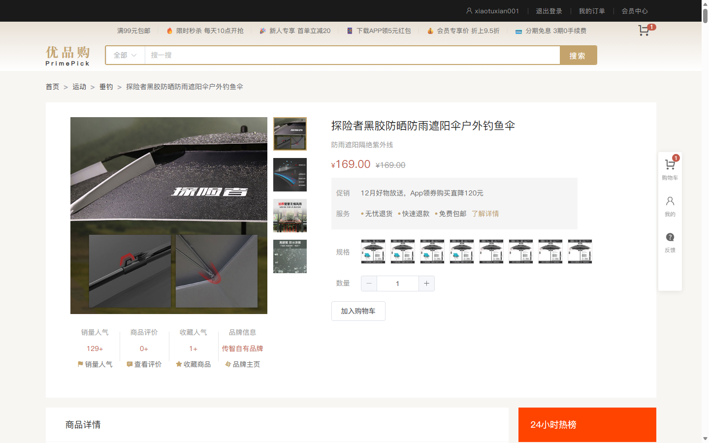
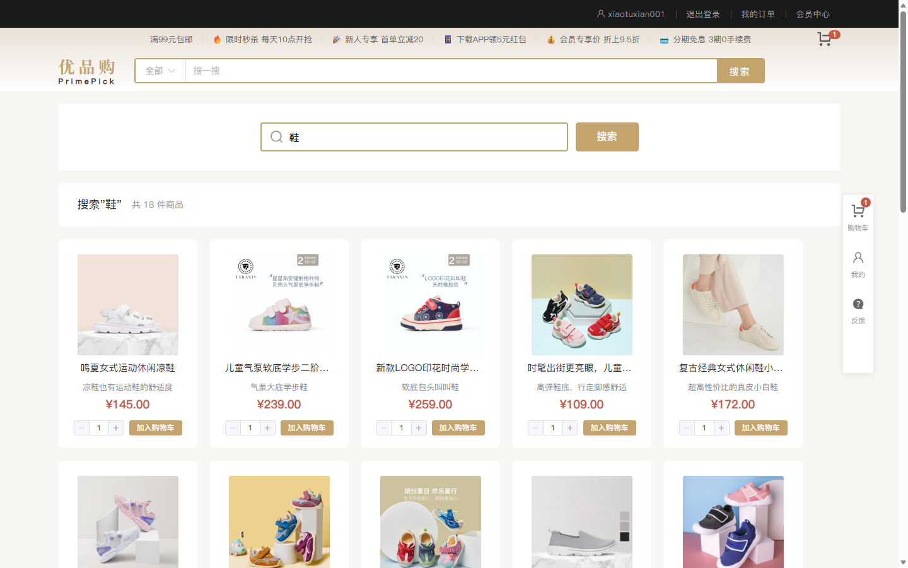
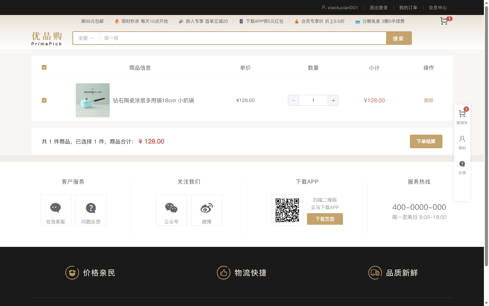
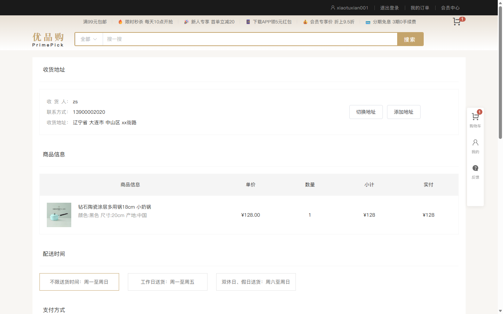
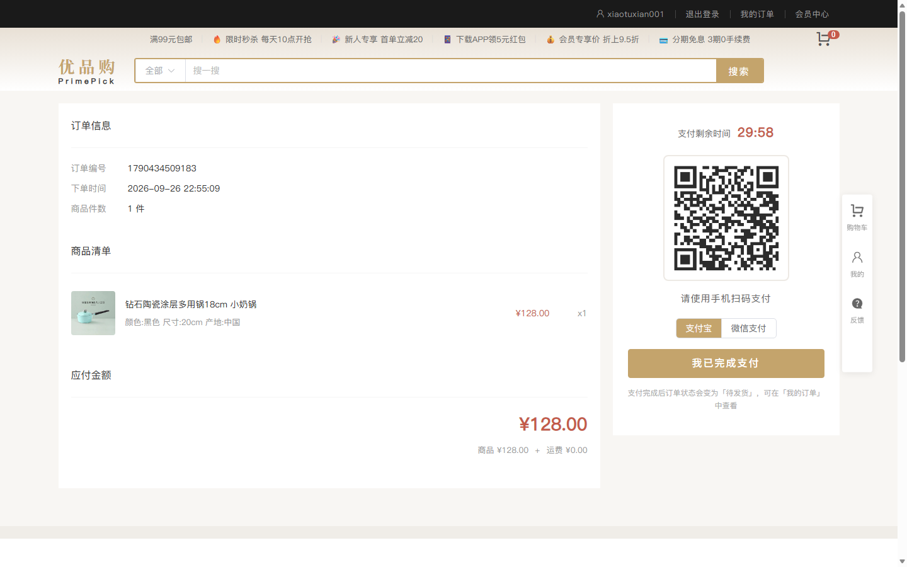
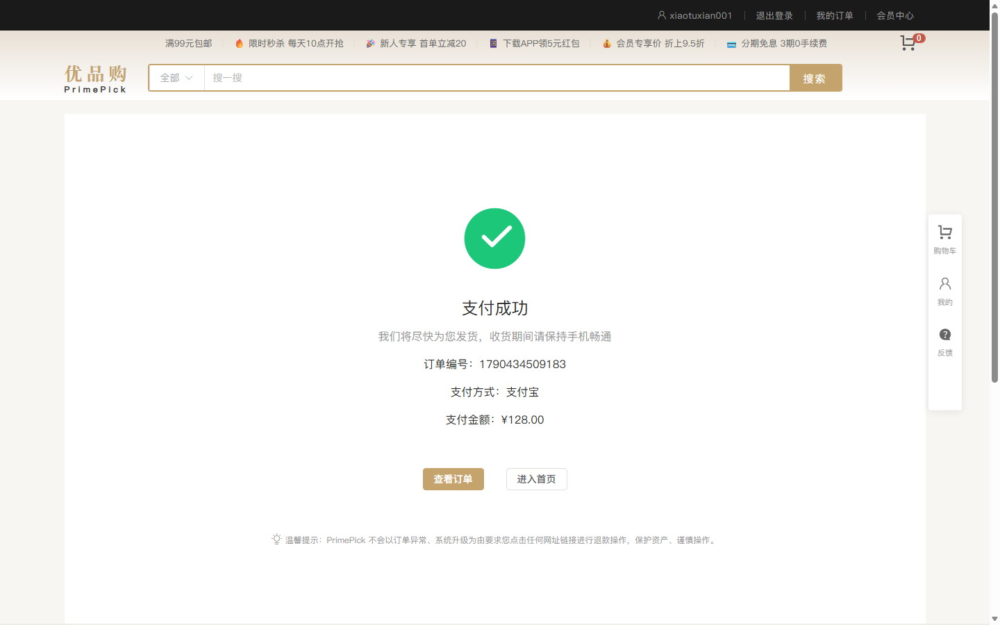
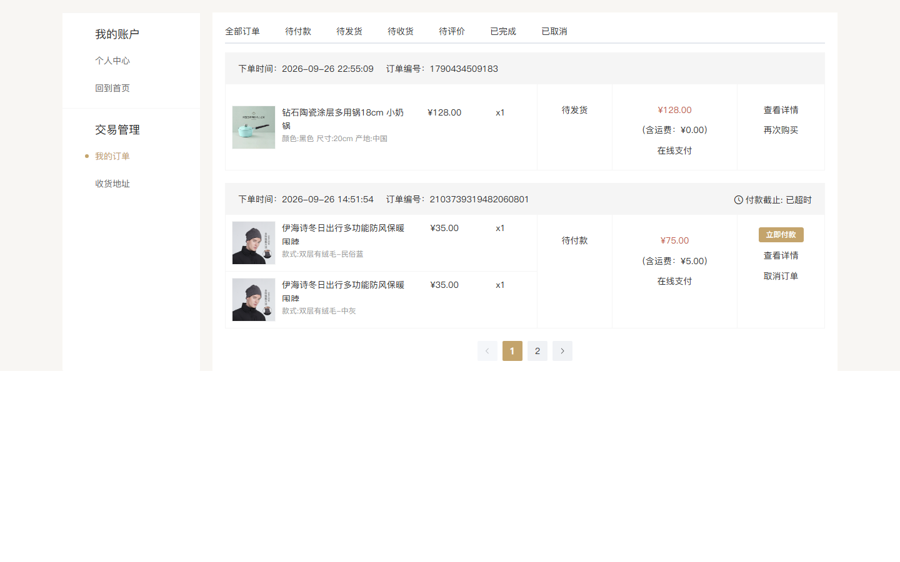
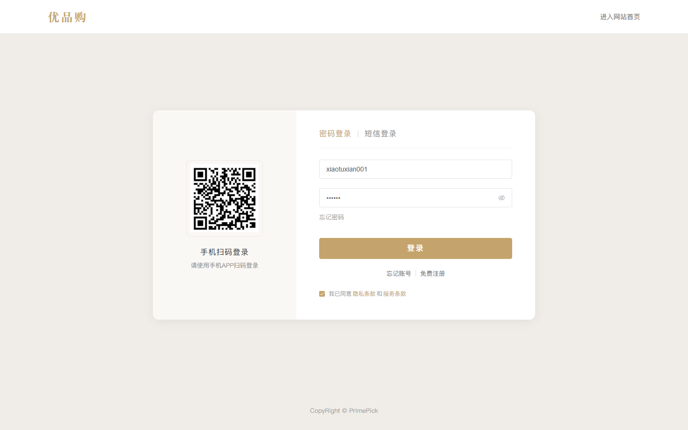
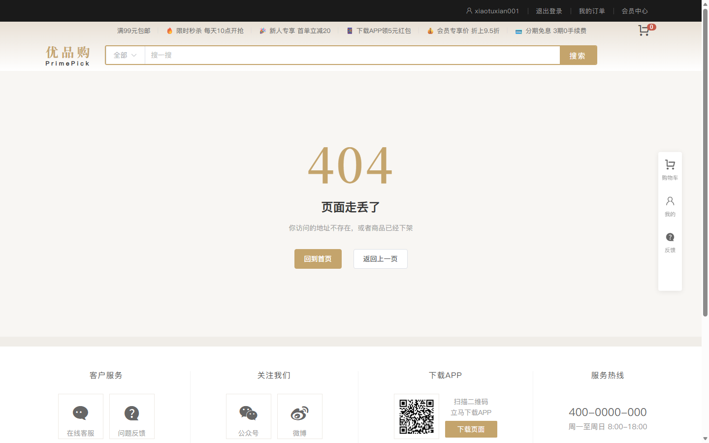

# PrimePick · 优品购

> 电商 SPA —— Vue 3 + Vite 8 + Pinia，覆盖「浏览 → 搜索 → 加购 → 结算 → 支付 → 订单」完整购物链路
>
> **在线预览**：`<部署后填入>` ｜ **构建状态**： 

> [!IMPORTANT]
> 首次发布前还需要替换的内容（避免忘记）：
> 1. 徽章与仓库地址里的 `<your-github-id>` / `<repo-name>`
> 2. 「在线预览」链接
> 3. 删除本提示块

---

## 项目简介

PrimePick 是一个前后端分离的电商前台项目，实现了完整的购物闭环：首页推荐、多级分类筛选、关键词搜索、商品详情与多规格 SKU 选择、购物车（登录/未登录双模式）、订单结算、支付、个人中心与订单管理。

项目重点不在于「页面多」，而在于**用工程化手段把性能、可维护性与协作规范做出来**：路由级代码分割、首屏体积预算门禁、双 linter + 提交门禁、CI 四关、可量化的优化前后数据。

## 界面预览

> 页面数据来自项目自带的 MSW mock 层（不依赖任何后端），截图由 `npm run screenshots` 用无头浏览器自动生成，保证与当前代码一致 —— 不是手工截的旧图。

### 操作演示


*约 13 秒。由 `npm run demo` 驱动**真实 UI** 录制（无头浏览器抓帧 + CDP 截图，再用 Pillow 合成），
不是录屏软件录的 —— 代码改了重跑一遍就得到最新演示。*

[](docs/screenshots/02-home-full.jpg)

*首页（点击查看整页大图）*

| 商品详情 · 多规格 SKU 联动 | 分类页 |
| --- | --- |
|  |  |

| 关键词搜索 | 购物车 |
| --- | --- |
|  |  |

| 订单结算 | 订单支付（订单绑定二维码 + 倒计时） |
| --- | --- |
|  |  |

| 支付结果 | 我的订单（首条为刚支付的订单） |
| --- | --- |
|  |  |

| 登录 | 404 兜底页 |
| --- | --- |
|  |  |

## 技术栈

| 分类 | 选型 |
| --- | --- |
| 框架 | Vue 3.5（Composition API + `<script setup>`） |
| 构建 | Vite 8（底层 Rolldown） |
| 状态管理 | Pinia 3 + `pinia-plugin-persistedstate` |
| 路由 | Vue Router 5（动态导入 + `meta` 驱动的守卫） |
| UI | Element Plus 2.13（按需引入 + SCSS 变量定制主题） |
| 样式 | SCSS + 设计变量（`src/styles/var.scss`） |
| 请求 | Axios 封装（token 注入 / 401 兜底 / 统一错误提示） |
| 工具库 | `@vueuse/core` |
| 测试 | Vitest 5（订单状态机 / SKU 幂集算法 / 时间格式化，23 个用例，CI 里跑） |
| 质量 | ESLint 10 + oxlint 1.60 双 linter、Husky、lint-staged、commitlint |
| CI | GitHub Actions |

## 性能优化成果（可复现）

数据来自 `npm run build && npm run size`，首屏 = `dist/index.html` 直接引用的入口 chunk + `modulepreload` + 样式表。

| 指标 | 优化前 | 优化后 | 变化 |
| --- | ---: | ---: | ---: |
| 首屏 JS（gzip） | 174.89 kB | **121.70 kB** | **−30%** |
| 首屏 CSS（gzip） | 33.70 kB | **14.32 kB** | **−58%** |
| 首屏合计（gzip） | 208.59 kB | **136.01 kB** | **−35%** |
| 最大单 chunk | 506.67 kB ⚠️ 触发 Vite 体积告警 | **80.86 kB** | 告警消失 |
| 产物数量 | 1 个 JS + 1 个 CSS | **64 个按路由/依赖拆分的 chunk** | 按需加载 |
| 生产构建耗时 | 14.60 s | **3.58 s** | **−75%** |

> 演示模式（`VITE_USE_MOCK=true`）下首屏还会按需加载 mock 层（gzip 191 kB，其中 fixtures 34.5 + MSW 运行时 156.5），
> 这部分**不参与业务分包基线**，`npm run size` 会把它单独列出来。关闭 mock 的构建不含这两个 chunk。

做了四件事：

1. **路由级动态导入**：原先 12 个页面全部静态 `import`，被打进同一个 506 kB 的 chunk。改为 `() => import()` 后按路由拆包，`Element Plus` 各组件与页面样式随路由懒加载（例如 `el-row/el-col` 栅格共 751 条规则、约 36 kB，只服务于地址表单，现在只在地址页加载）。
2. **只对框架层做显式分包**：`build.rolldownOptions.output.codeSplitting` 仅把 `vue/vue-router/pinia` 拆成 `vendor-vue`，提升业务代码变更后的缓存命中率。
   > 踩过的坑：一开始按 `node_modules` 一把梭分了 `element-plus` / `vendor` 两组，结果把只在懒加载页面用到的库强行并入首屏依赖，首屏从 413 kB 反弹到 643 kB。**分包不是越细越好，要看模块是否真的在首屏依赖图里。**
3. **体积预算门禁**：`scripts/size-report.mjs` 解析构建产物，首屏 JS/CSS 超出预算（135 kB / 20 kB）直接以非 0 退出码失败，并接入 CI Job Summary —— 体积回退不会悄悄溜进主干。
4. **清理死代码与死资源**：删除脚手架残留（`App.vue` 中 60 行无匹配元素的 scoped 样式、`assets/base.css`、`assets/main.css`、6 个未引用图片）、重复的根目录 `settings.json` / `extensions.json`。

## 工程化规范

| 能力 | 实现 |
| --- | --- |
| 双 linter | `oxlint`（快，~15ms）+ `eslint` + `eslint-plugin-vue`；用 `eslint-plugin-oxlint` 读取同一份 `.oxlintrc.json` 关闭重复规则，避免两套规则打架 |
| 提交门禁 | Husky `pre-commit` → `lint-staged` 只检查本次改动文件；`commit-msg` → commitlint 校验 Conventional Commits |
| CI | GitHub Actions：`lint` / `test` / `build` 三个 job，npm 缓存 + 同分支并发取消，产物体积与**首屏预算门禁**写入 Job Summary |
| 依赖维护 | Dependabot 按 Vue 生态 / lint 工具链 / 构建工具链分组升级，减少 PR 噪音 |
| 协作 | `.github/PULL_REQUEST_TEMPLATE.md` 含自查清单（lint、构建体积、主流程回归） |
| 规范提交 | `feat` / `fix` / `refactor` / `perf` / `docs` / `chore` 等类型，中文描述 |

> 关于 lint 配置：`flat config` 是「后者覆盖前者」，自定义 `rules` 必须放在 `js.configs.recommended` 与 `pluginVue.configs` **之后**，否则会被覆盖回默认值 —— 原配置就踩了这个坑，导致 `vue/multi-word-component-names` 的关闭声明失效，11 个 error 一直挂在仓库里。

## 架构设计

```
src/
├── apis/             # 接口层：按业务域拆分（home/category/detail/cart/order/pay/...）
├── composables/      # 组合式函数：useAsyncData / usePagination / useAuth / useSearchHistory
├── stores/           # Pinia：userStore / cartStore / categoryStore（持久化）
├── router/           # 15 条路由：全部懒加载 + meta 驱动守卫 + 404 兜底 + 标题同步
├── components/       # 全局组件：XtxSku 多规格选择器、XtxImageView 图片放大镜
├── directives/       # 自定义指令：v-img-lazy（IntersectionObserver 图片懒加载）
├── utils/            # http 请求封装、全局错误兜底
├── styles/           # 全局重置 + 设计变量 + Element Plus 主题覆盖
└── views/            # 页面（Home / Category / Detail / CartList / Checkout / Pay / Member / NotFound）
```

几个值得说明的设计决策：

- **`meta` 驱动路由守卫**：认证需求写在路由 `meta.requiresAuth` 上，用 `to.matched.some(...)` 判断，父路由声明后子路由自动继承。替代原先手写的路径白名单数组 —— 新增页面不会漏配，且登录后能带着 `query`/`hash` 回到原页面。
- **`useAsyncData` 统一三态**：把 `data / loading / error` 与「组件卸载后不再写回状态」的竞态保护收敛到一处，各页面不再各写一套。
- **全局错误兜底**（`src/utils/errorHandler.js`）：统一接管组件内异常（`app.config.errorHandler`）、未处理的 Promise rejection、静态资源加载失败三类错误，`reportError` 预留了接入错误上报平台的出口。
- **SKU 规格联动**：`XtxSku` 通过幂集算法构建「已选规格组合 → skuId」的路径字典，实现无库存规格自动置灰。
- **支付链路状态自洽**：支付页按 `route.query.id` 拉取订单（订单号 / 下单时间 / 商品清单 / 应付金额），
  二维码由订单号**动态生成**（不再是所有订单共用的静态图），支付后订单真的变成「待发货」，不会出现「付过款仍是待付款」。
  在此基础上补齐了真实感细节：**支付结果轮询确认**（不做乐观更新 —— 支付不可逆，必须查清状态）、
  **超时由服务端关单**（前端只反映状态）、取消订单 / 确认收货走真接口并带**幂等保护**（连点只发一次请求）、
  货到付款订单不展示二维码。整条链路由端到端冒烟脚本逐项断言。
- **首屏占位**：`index.html` 内联了一个极简品牌占位块，JS 解析执行完成前不会白屏。

## 快速开始

```bash
npm install          # 安装依赖（首次会自动安装 husky git hooks）
npm run dev          # 开发服务器 http://localhost:5173
npm run build        # 生产构建
npm run test         # Vitest 单元测试（订单状态机 / 幂集算法 / 时间格式化）
npm run size         # 产物体积报告 + 首屏预算校验
npm run smoke        # 无头浏览器端到端冒烟（17 项断言：首页 / 详情页健壮性 / 结算下单 / 支付链路）
npm run screenshots  # 生成 README 用的页面截图（无头浏览器）
npm run demo         # 重录操作演示 GIF（需要本机 Python + Pillow）
npm run preview      # 本地预览构建产物
npm run lint         # oxlint + eslint 检查（CI 用，不修改文件）
npm run lint:fix     # 自动修复

# 数据层（见下方「数据层：MSW mock」）
npm run fixtures:capture   # 抓取真实接口响应生成 fixture（需要外网）
npm run fixtures:summary   # 打印接口契约 + 校验 handler 的 fixture 引用
```

默认 `VITE_USE_MOCK=true`，**不需要任何后端即可完整运行**（含登录、加购、下单）。想连真实接口就把 `.env.development` 里的 `VITE_USE_MOCK` 改成 `false`，此时 `/api` 由 Vite 代理转发，目标地址读 `VITE_PROXY_TARGET`。

## 数据层：MSW mock

项目已不依赖任何外部后端：**30 个端点的真实响应**被固化成 fixture，由浏览器内的 Service Worker（MSW）接管，因此部署成纯静态站点也能完整演示。

```
mocks/
├── utils.js          # fixture 加载（import.meta.glob）、响应信封、模拟延迟、鉴权判断
├── data-store.js     # 购物车 / 地址 / 订单的可变状态（localStorage 持久化，用 fixture 做种子）
├── handlers/         # home / category / goods / cart / member / user，覆盖 src/apis 全部接口
├── browser.js        # setupWorker 入口（main.js 在 mount 前等它就绪）
└── fixtures/         # 30 份真实响应 + _manifest.json（端点 → 文件 的契约清单）
```

几个刻意的设计：

- **不是「回放静态数据」**：购物车、地址、订单用 localStorage 维护可变状态，加购 / 删地址 / 下单都真的生效，刷新还能保留；结算页金额由当前购物车实时算出，与购物车内容始终一致。
- **响应体与线上完全同构**（`{ code, msg, result }`），所以切真实后端时前端一行都不用改。
- **模拟 120~300ms 延迟**：否则本地 mock 毫秒级返回，loading / 骨架屏状态根本看不到。
- **未匹配的请求会告警**（`onUnhandledRequest: 'warn'`），漏配接口无处藏身。
- **可整体摘除**：方案 B（自建 Node 后端）落地后，把 `VITE_USE_MOCK` 改成 `false`、`mocks/` 整个目录删掉即可 —— fixture 还能直接当数据库 seed。

端到端验证（CI 里会跑）：

```
$ npm run smoke
  [OK]   preview 服务就绪
  [OK]   商品卡片渲染成功（.goods-item x32）
  [OK]   Vue 已挂载（首屏占位被替换）
  [OK]   图片来自 fixture 真实数据（42/79 张）
  [OK]   文档标题被 router.afterEach 改写
  [OK]   没有未捕获异常 / console.error
```

`scripts/smoke-mock.mjs` **零依赖**：用 Node 内置 `fetch` + `WebSocket` 直接讲 Chrome DevTools Protocol，
复用系统已装的 Edge/Chrome，不下载浏览器。详见 [`docs/iteration-2a-mock-report.md`](docs/iteration-2a-mock-report.md)。

## 部署

项目是 SPA，使用 HTML5 History 路由，部署时**必须配置 fallback 到 `index.html`**，否则刷新 `/detail/1` 会 404。

**Vercel / Netlify**：仓库已包含 `vercel.json`（含 `assets` 长缓存与 `index.html` 不缓存的响应头）和 `public/_redirects`，导入仓库即可；构建命令 `npm run build`，输出目录 `dist`。

**Docker（Nginx）**：

```bash
docker build -t primepick .
docker run -p 8080:80 primepick
```

`nginx.conf` 包含 SPA 回退、`/assets` 一年强缓存（文件名带内容 hash）、`index.html` 不缓存、gzip 与基础安全响应头。

## 本地演示账号

```
账号：demo
密码：123456
```

登录页已预填这组凭据，直接点「登录」即可进入会员中心。

## 已知限制与迭代计划

这一版是「工程化地基 + 门面」，以下问题我明确知道并已排期，不装作不存在：

| 限制 | 影响 | 计划 |
| --- | --- | --- |
| ~~后端依赖第三方教学 API~~ | **已解决** | 已用 MSW mock 层接管 30 个端点，纯静态站点即可完整运行（见上方「数据层」） |
| 已有 23 个单测，但覆盖面仍窄 | 组件与 store 还没有测试，重构时仍可能踩空 | Playwright 主链路 E2E 替换当前冒烟脚本；补 composables / store 单测 |
| mock 运行时依赖放在 devDependencies | 演示模式会把 MSW 打进产物（191 kB gzip，仅演示时加载） | 方案 B 落地后移除 `msw` 与整个 `mocks/` 目录 |
| 未迁移 TypeScript | 接口契约与领域模型无类型约束 | `allowJs` 渐进迁移，优先数据层，`vue-tsc` 进 CI（fixtures 与 `_manifest.json` 已提供现成契约） |
| 支付未接真实网关（需企业资质） | 由 mock 的 `POST /member/order/:id/pay` 推进状态；已实现**结果轮询 + 服务端超时关单 + 取消/确认收货 + 幂等保护**，17 项端到端断言覆盖 | 支付漏斗埋点、幂等键下沉到后端（P2） |
| 布局面向 1240px 桌面端 | 无移动端适配 | 补响应式断点与移动端导航 |
| 购物车无乐观更新 | 加购需等接口返回 | 乐观更新 + 失败回滚 + `BroadcastChannel` 跨标签同步 |

完整优化路线图见 [`docs/optimization-plan.md`](docs/optimization-plan.md)；
已完成的改动明细见 [`docs/iteration-1-report.md`](docs/iteration-1-report.md)（工程化与性能）与
[`docs/iteration-2a-mock-report.md`](docs/iteration-2a-mock-report.md)（数据层与端到端验证）。
